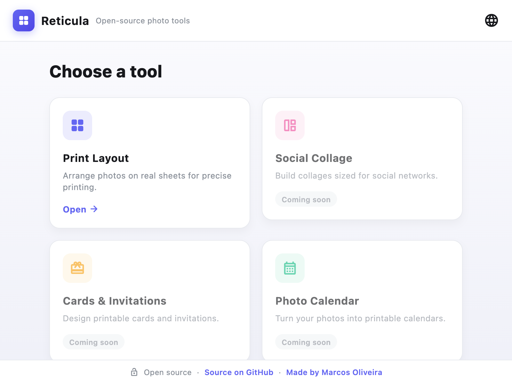
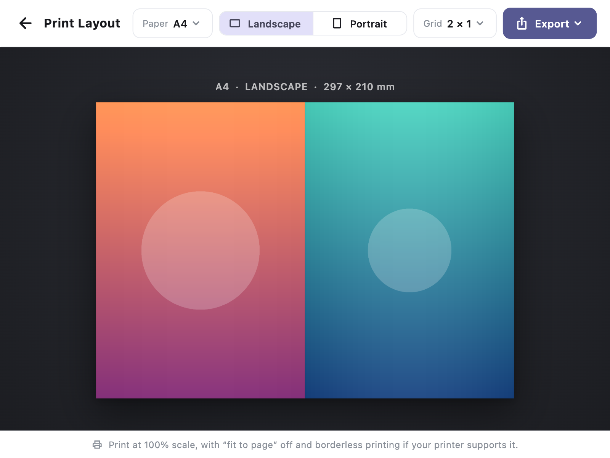

# Reticula

Free and open source software for creating photo layouts on real print sheets,
built with Flutter and Dart.

> ⚠️ **Status: early alpha.** Reticula is usable for testing, but it is young —
> expect missing features, rough edges, and changes between versions.

[](https://github.com/marcossoliveira/reticula/actions/workflows/build.yml)
[](LICENSE)

- **Live demo (early alpha):** <https://project-reticula.web.app>
- **Made by:** [Marcos Oliveira](https://github.com/marcossoliveira)

## What is Reticula?

Reticula helps you arrange photos on real paper formats (such as A4) and export a
print-ready file at the correct physical size. The page is the source of truth:
everything is measured in millimetres, so what you see on screen matches what you
print.

Today it has a single tool, **Print Layout**. It is the first of a small planned
suite of photo utilities.

## Why Reticula?

Printing photos at an exact size, with no margins and controlled framing, is
awkward with generic tools: office suites resize unpredictably, and photo apps
rarely think in real paper dimensions. Reticula keeps the layout physically
accurate from screen to paper, and exports are computed from the document model —
never captured from the screen.

## Current Status

Reticula is in **early alpha**. The app runs and exports correctly on desktop,
and there is an experimental web demo. It is still small and evolving, so the UI,
file formats and APIs may change.

## Features

Implemented today, in the **Print Layout** tool:

- **Paper sizes:** A3, A4, A5, A6, Letter, Legal, 10 × 15 cm and 13 × 18 cm.
- **Orientation:** portrait or landscape.
- **Grids:** 1, 2 (side-by-side or stacked), 4, 6, 8, 9 and 12 equal cells that
  tile the sheet edge-to-edge with no margin.
- **Framing:** drag to reposition, scroll or pinch to zoom, double-click to
  reset. Each image fills its cell (cover) and is clipped to it.
- **Export:** PDF, PNG (300 DPI) and JPEG (300 DPI), computed from the model.
- **Localization:** English, Português (Brasil), Español, Italiano, Deutsch,
  日本語 and 中文, following the system language with an in-app switcher.

For example, A4 landscape with a 2 × 1 grid produces two A5-portrait photos side
by side, with no margin (≈ 3508 × 2480 px at 300 DPI).

## Planned Features

These are **planned** and not available yet:

- Save and open projects (`.reticula` files)
- Drag-and-drop image import
- System print dialog
- Margins, gutters and cut guides
- Additional suite tools (Social Collage, Cards, Calendar, Photo Book, Labels),
  shown as "coming soon" in the app
- Android and iOS builds

See [ROADMAP.md](ROADMAP.md) and [CHANGELOG.md](CHANGELOG.md) for more.

## Screenshots

| Tool launcher | Print Layout |
|:---:|:---:|
|  |  |

> Early alpha — sample images shown. The interface follows your system language
> (English shown here).

## Tech Stack

- Flutter and Dart
- [`pdf`](https://pub.dev/packages/pdf) — physical-size PDF generation
- [`printing`](https://pub.dev/packages/printing) — rasterize the PDF to PNG/JPEG at a real DPI
- [`image`](https://pub.dev/packages/image) — JPEG encoding
- [`file_selector`](https://pub.dev/packages/file_selector) — native open/save dialogs
- [`url_launcher`](https://pub.dev/packages/url_launcher) — open repository and author links
- `flutter_localizations` and `intl` — localization

The core (document model and layout maths) is pure Dart with no Flutter
dependency, so it is easy to test and reuse.

## Platforms

| Platform | Status |
|----------|--------|
| macOS    | Runs; primary development target |
| Web      | Experimental — live demo: <https://project-reticula.web.app> |
| Windows  | Builds in CI — experimental, not extensively tested |
| Linux    | Builds in CI — experimental, not extensively tested |
| Android  | Planned — not built yet |
| iOS      | Planned — not built yet |

## Getting Started

Prerequisites: [Flutter](https://docs.flutter.dev/get-started/install) (stable
channel). Check your setup with `flutter doctor`.

```bash
git clone https://github.com/marcossoliveira/reticula.git
cd reticula
flutter pub get
```

## Running Locally

```bash
flutter run -d macos      # or: -d windows, -d linux, -d chrome
```

To run the tests and static analysis:

```bash
flutter test
flutter analyze
```

You can also render a sample PDF without the GUI:

```bash
dart run tool/sample_export.dart /output/dir
```

## Building

```bash
flutter build macos       # or: windows, linux, web
```

Continuous integration ([`.github/workflows/build.yml`](.github/workflows/build.yml))
builds macOS, Windows, Linux and Web on every push and pull request. Pushing a
version tag (for example `v0.1.1-alpha`) additionally publishes a GitHub Release
with the desktop builds attached and deploys the web app to Firebase Hosting.

To regenerate the app icons from the logo:

```bash
dart run flutter_launcher_icons
```

## Printing

Reticula produces borderless files, but true borderless printing also depends on
your printer and driver. When printing, use:

- Scale: **100%**
- Fit to page: **off**
- Borderless: **on**, if your printer supports it

## Project Structure

```text
reticula/                      # repository root = the Flutter app
  .github/workflows/build.yml  # CI: build macOS / Windows / Linux / Web
  firebase.json                # Firebase Hosting config
  l10n.yaml
  assets/icon/                 # app icon source
  lib/
    main.dart
    l10n/                      # ARB files (7 languages) + generated localizations
    src/
      core/                    # pure Dart, no Flutter — the source of truth
      export/                  # PDF / PNG / JPEG, plus cross-platform file saving
      ui/                      # editor + launcher
  tool/sample_export.dart      # dev tool: render a sample PDF from the model
  test/                        # unit + widget tests
  macos/ windows/ linux/ web/ android/ ios/
```

`core/` and `export/` are pure Dart and UI-free, ready to be extracted as
standalone packages later.

## Roadmap

See [ROADMAP.md](ROADMAP.md). It describes direction only — no dates are promised.

## Contributing

Contributions are very welcome — code, design, docs, translations, bug reports,
and especially real-world print testing. See [CONTRIBUTING.md](CONTRIBUTING.md)
to get started, and please follow the [Code of Conduct](CODE_OF_CONDUCT.md).

## License

Reticula is licensed under the GNU General Public License v3.0.

See [LICENSE](LICENSE) for details.
